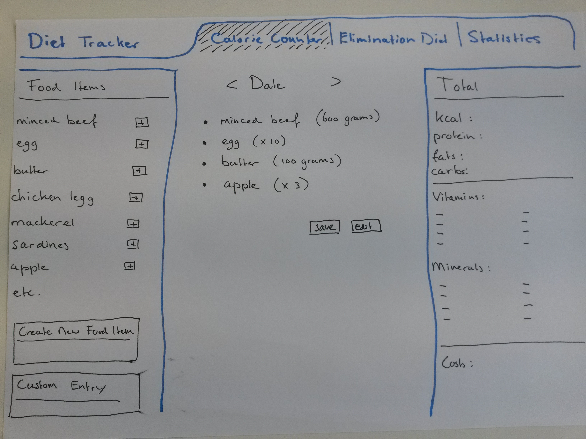
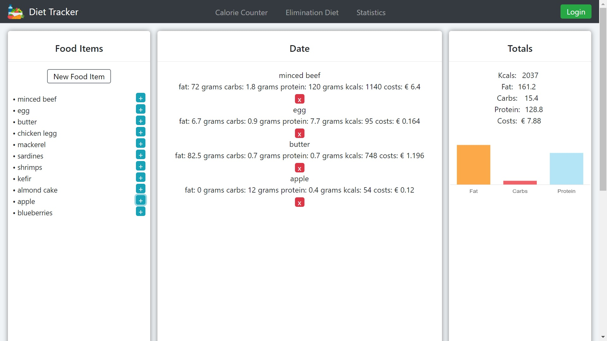

# Diet tracker

I am aiming to build a program that lets me track the following aspects of my diet:

- caloric intake
- macronutrients (protein, fats and carbohydrates)
- vitamins and minerals
- daily costs

In addition I will try to implement a diary that monitors:

- different stages of my ongoing elimination diet
- physical reactions to food intolerances 
- body weight development

This program is intended to replace my already existing and inefficient diet logs, and hopefully will make my daily diet tracking less of a chore.

Development process:

During the first development phase I will focus on getting the calorie counter working.

- [x] sketch core idea
- [x] create basic framework in html and css
- [x] add food items including basic attributes (kcal, protein fats, carbs, price)
- [x] create a list in main body of the website that shows the food intake of the day
- [x] implement the option to add list items from the left of the screen to the center of the screen
- [x] display totals on the right side of the screen

After this I will re-evaluate the development process and overthink the second phase of development.

# Update 12-06-2019:

Development plan

I want to:

- [x] Create a database connection for my Food Items section to enable food item management.
	- [x] Add the option to add a new food item to the food items list, logging fats, carbs, proteins, kcals and price to the food items database after pressing the new food item button.
	- [x] Add edit buttons attached to individual food items to change object properties.
	- [x] Add delete buttons attached to individual food items to delete the entire object from both the screen and the database.
	- [x] Add the option to insert a food item per 100 grams while creating a new food item.
	- [x] Add the option to insert a food item per piece while creating a new food item, for example, 1 egg or 1 apple.
	- [x] Insert a check after editing or deleting a food item. "Are you sure you want to ..".
	- [ ] Build a custom entry section to add name, kcals and other attributes to the date section without creating a new food item.
	- [ ] Rebuild the food items section into a table and by doing so, implement a sort function.
- [x] Styling for the Food Items section:
	- [x] Give the input field proper labels.
	- [ ] Add a vertical scroll bar to the listed items to keep the website compact. 
	- [x] Hide the edit and delete buttons.
	- [x] Show the edit and delete buttons on hover.
	- [x] Add an on hover effect when hovering over an item, showing the three buttons and making them clickable.
	- [x] Implement overall styling improvements, creating a clean and practical look.
- [x] Overhaul the 'Date' section.
	- [ ] Give this section the name 'Diary'.
	- [x] Add previous and next buttons to navigate between the current day and previous days.
	- [x] Setting grams for listed food items.
	- [x] Setting amount for listed food items in case of listings per piece (apples, eggs).
	- [x] Add edit buttons attached to individual listed items to change the amount.
	- [x] Hide the edit and delete buttons.
	- [ ] Add an on hover effect when hovering over an item, showing the delete and edit buttons.
	- [x] While editing, display an input field to update the the amount of the listed food item.
	- [x] Create a second database that logs the daily food intake.
	- [ ] Add a save button at the bottom part of the added food items to store the data in the database.
	- [ ] Add a vertical scroll bar in case the listed items exceed the screen estate.
	- [x] Add a weight section, logging weight at two different times of the day, for example morning and evening.
	- [ ] Add a drag and drop function to this section in order to let the user sort the added food items.
	- [x] Implement overall styling improvements, creating a clean and practical look.
- [ ] Totals section:
	- [x] Implement overall styling improvements, creating a clean and practical look.
- [ ] Overall styling:
	- [x] Implement overall styling improvements, creating a clean and practical look.
	- [ ] Make the navbar responsive.
	- [ ] Make the body of the website responsive. 

Further plans:

- [ ] Create a login option, personalised space.
- [ ] Adapt the website to a smartphone environment.
- [ ] Create a statistics tab.
- [ ] Create an elimination diet tab.

# Update 20-12-2019:

